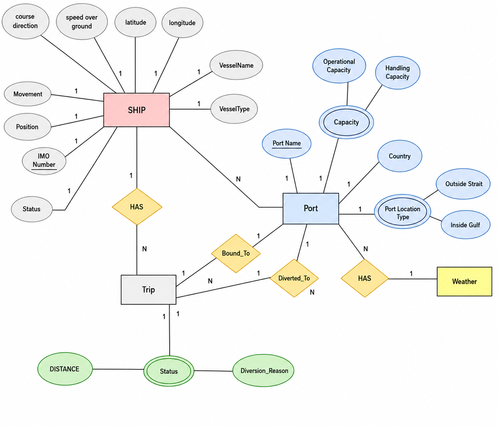

# 🚢 Maritime Rerouting & Port Contingency System (Oman Vision 2040)

A centralized database schema designed to support **Oman's Vision 2040** digital transformation in the maritime logistics sector. This system provides automated, real-time rerouting mechanisms for vessels bound for ports inside the Arabian Gulf during emergency closures of the Strait of Hormuz.

---

## 📐 Entity-Relationship Diagram (ERD)

| Initial Draft (Before Revisions) | Finalized ERD Model (Current) |
| :---: | :---: |
|  |  |
| *Note: Initial proposed design prior to structural attribute and cardinality fixes.* | *Note: Refined and optimized schema ready for database implementation.* |

---

## 🎯 Key Objectives

* **Strategic Rerouting:** Instantly redirects ships to safe, alternative Omani ports outside the Strait of Hormuz.
* **Congestion Relief:** Prevents vessel stacking and extended anchoring in international waters.
* **Operational Accuracy:** Accelerates cargo reception, handling, and offloading through real-time port capacity tracking.
* **Digital Transformation:** Aligns with Oman Vision 2040 by digitizing port interactions and maritime operations.

---

## 🏛️ System Entities & Relationships

| Entity | Primary Key | Description |
| :--- | :--- | :--- |
| **`SHIP`** | `IMO Number` | Stores vessel positioning (`latitude`, `longitude`, `speed`), navigation movement, and identification (`MMSI`, `VesselType`). |
| **`Port`** | `Port Name` | Captures location types (*Outside Strait* vs. *Inside Gulf*) and capacity thresholds (`Operational Capacity`, `Handling Capacity`). |
| **`Trip`** | `Trip_ID` | Tracks origin/destination routes via `Bound_To` and emergency diversions via `Diverted_To`. |
| **`Weather`** | `Weather_ID` | Monitors sea conditions associated with ports via the `HAS` relationship to ensure safe docking. | docking. |

