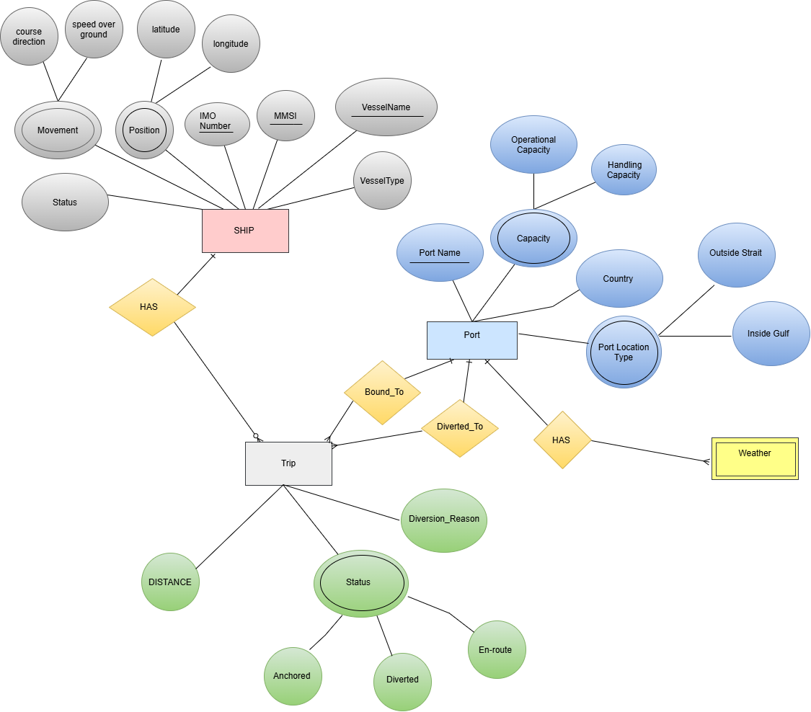
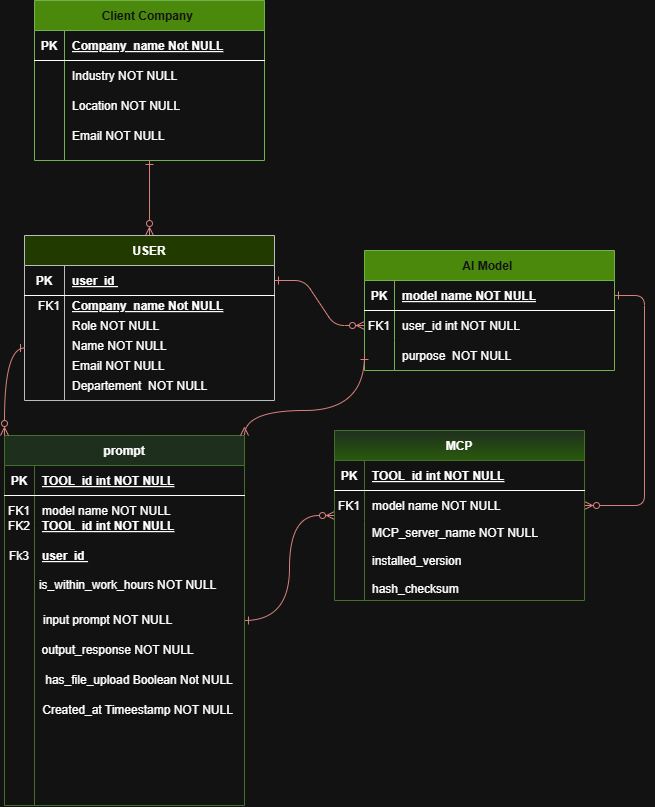
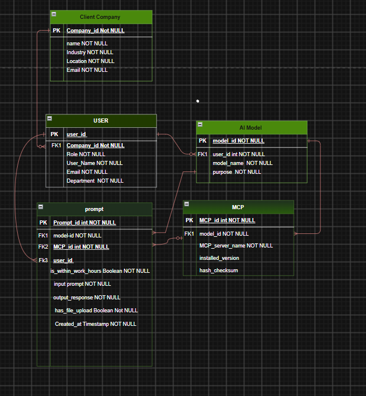

# 🚢 Maritime Rerouting & Port Contingency System (Oman Vision 2040)

A centralized database schema designed to support **Oman's Vision 2040** digital transformation in the maritime logistics sector. This system provides automated, real-time rerouting mechanisms for vessels bound for ports inside the Arabian Gulf during emergency closures of the Strait of Hormuz.

---

## 📐 Entity-Relationship Diagram (ERD)

| Initial Draft (Before Revisions) | Finalized ERD Model (Current) |
| :---: | :---: |
|  |  |
| *Note: Initial proposed design prior to structural attribute and cardinality fixes.* | *Note: Refined and optimized schema ready for database implementation.* |

---

## 🎯 Key Objectives

* **Strategic Rerouting:** Instantly redirects ships to safe, alternative Omani ports outside the Strait of Hormuz.
* **Congestion Relief:** Prevents vessel stacking and extended anchoring in international waters.
* **Operational Accuracy:** Accelerates cargo reception, handling, and offloading through real-time port capacity tracking.
* **Digital Transformation:** Aligns with Oman Vision 2040 by digitizing port interactions and maritime operations.

---

## 🏛️ System Entities & Relationships

| Entity | Primary Key | Description |
| :--- | :--- | :--- |
| **`SHIP`** | `IMO Number` | Stores vessel positioning (`latitude`, `longitude`, `speed`), navigation movement, and identification (`MMSI`, `VesselType`). |
| **`Port`** | `Port Name` | Captures location types (*Outside Strait* vs. *Inside Gulf*) and capacity thresholds (`Operational Capacity`, `Handling Capacity`). |
| **`Trip`** | `Trip_ID` | Tracks origin/destination routes via `Bound_To` and emergency diversions via `Diverted_To`. |
| **`Weather`** | `Weather_ID` | Monitors sea conditions associated with ports via the `HAS` relationship to ensure safe docking. | docking. |

# 🛡️ LLM Security & Prompt Monitoring Firewall

An enterprise-grade relational database schema designed for an **LLM Security Platform**. This system serves as a real-time monitoring, telemetry, and threat-prevention layer between application users, Model Context Protocol (MCP) integrations, and LLMs to detect and mitigate **AI Red Teaming** attacks (e.g., Prompt Injection, Jailbreaking, and Data Exfiltration).

---

## 📐 Database Architecture Diagram (ERD)

| Initial Architecture (Before) | Updated Architecture (Current) |
| :---: | :---: |
|  |  |
| *Note: Initial proposed data model for prompt monitoring.* | *Note: Updated schema incorporating MCP servers and refined telemetry attributes.* |

---

## 🏛️ Core Entities & Data Dictionary

| Entity | Primary Key | Description |
| :--- | :--- | :--- |
| **`Client Company`** | `Company_id` | Multi-tenant organization baseline using the security monitoring platform. |
| **`USER`** | `user_id` | Tracks internal developers or system users attached to a specific company. |
| **`AI Model`** | `model_id` | Catalog of protected LLM instances monitored by the firewall. |
| **`MCP`** | `MCP_id` | Represents Model Context Protocol servers; includes `hash_checksum` for integrity verification. |
| **`prompt`** | `Prompt_id` | Central audit trail capturing raw telemetry, timestamps, work-hour anomalies, and file uploads. |

---

## 🔒 Key Security Capabilities

* **Prompt Telemetry & Forensic Logging:** Records input prompts and LLM output responses for deep inspection.
* **MCP Integration Safeguards:** Verifies MCP server versions and checksums to prevent supply-chain tampering.
* **Contextual Anomaly Detection:** Flags off-hour activity (`is_within_work_hours`) and potential file-based injection vectors (`has_file_upload`).
* **Red Teaming Mitigation:** Provides structured data to quickly analyse and block adversarial attacks.

